# Eatlas (NearEat) — Mimari Dokümanı

> Bu doküman, projeyi hiç bilmeyen birinin tüm sistemi kafasında canlandırabilmesi için
> yazılmıştır. Tüm diyagramlar [Mermaid](https://mermaid.js.org/) formatındadır; GitHub,
> VS Code (Mermaid eklentisi) ve birçok Markdown görüntüleyici bunları otomatik çizer.

---

## İçindekiler
1. [Tek bakışta sistem](#1-tek-bakışta-sistem)
2. [Bileşenler ve dış servisler](#2-bileşenler-ve-dış-servisler)
3. [Backend istek boru hattı](#3-backend-istek-boru-hattı)
4. [Backend katman mimarisi](#4-backend-katman-mimarisi)
5. [Mobil uygulama mimarisi](#5-mobil-uygulama-mimarisi)
6. [Üç rol ve ekran ağacı](#6-üç-rol-ve-ekran-ağacı)
7. [Veri modeli (ER diyagramı)](#7-veri-modeli-er-diyagramı)
8. [Önemli akışlar (sequence diyagramları)](#8-önemli-akışlar)
9. [Zamanlanmış işler (cron)](#9-zamanlanmış-işler-cron)
10. [Dağıtım ve ölçeklenme](#10-dağıtım-ve-ölçeklenme)

---

## 1. Tek bakışta sistem

Eatlas, **yapay zekâ destekli bir restoran keşif uygulamasıdır.** İki ana program tek bir Git
deposunda (monorepo) durur: telefondaki uygulama (`neareat-mobile`) ve sunucudaki beyin
(`neareat-backend`). Telefon "aptal ve hızlı" tutulur — sadece gösterir ve ister; tüm gizli
anahtarlar, kurallar ve hesaplar backend'dedir.

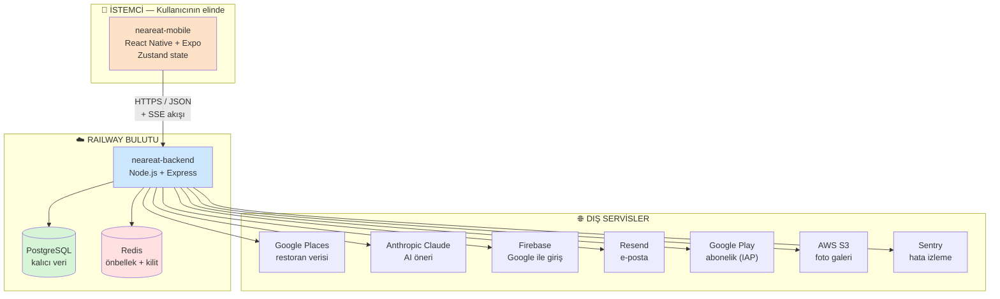

**Benzetme:** Mobil = garson (müşteriyle konuşur, mutfak deposuna asla girmez). Backend =
mutfak (asıl işi yapar, depodan/tedarikçiden malzeme alır). PostgreSQL = ana depo (kalıcı).
Redis = tezgahtaki hazır malzeme (hızlı ama geçici).

---

## 2. Bileşenler ve dış servisler

| Bileşen | Teknoloji | Görevi |
|---------|-----------|--------|
| **neareat-mobile** | React Native (Expo ~52), Zustand, TypeScript | Kullanıcı arayüzü (Android APK) |
| **neareat-backend** | Node.js, Express, Prisma | Tüm iş mantığı + API |
| **PostgreSQL** | Prisma ORM | Kullanıcı verisi (yorum, favori, rezervasyon...) |
| **Redis** | ioredis | Önbellek (Google/AI maliyet kalkanı) + cron kilidi + oturum |
| **Google Places** | REST | Restoran arama, detay, fotoğraf — *restoranlar DB'de tutulmaz* |
| **Anthropic Claude** | SSE streaming | AI öneri (Haiku/Sonnet) + restoran iş raporu |
| **Firebase** | Admin SDK | Google OAuth ile giriş doğrulama |
| **Resend** | REST | E-posta doğrulama / şifre sıfırlama / hoş geldin |
| **Google Play** | androidpublisher | Premium abonelik doğrulama + RTDN webhook |
| **AWS S3** | SDK | Restoran fotoğraf galerisi |
| **Sentry** | DSN | Hata ve güvenlik olayı izleme (env-gated) |

---

## 3. Backend istek boru hattı

Gelen **her** HTTP isteği, [app.js](neareat-backend/src/app.js) içinde tanımlı sırayla bir
dizi "kapıdan" geçer (havaalanı güvenlik kontrolü gibi). Sıra önemlidir: önce ölç ve koru,
sonra işle.

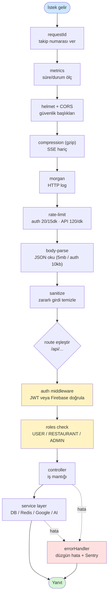

**Önemli detaylar:**
- **Rate limiting katmanlı:** `authLimiter` (giriş brute-force koruması), `apiLimiter`
  (genel), `adminLoginLimiter` (admin'e ekstra sıkı), ayrıca AI uçlarında Redis tabanlı
  `aiRateLimit` — Redis düşerse **fail-closed** (düşük in-memory tavan ile harcamayı kısar).
- **`/health`** ucu: DB + Redis pingler; kapanış sırasında (`isShuttingDown`) **503** döner
  ki yük dengeleyici trafiği başka replikaya kaydırsın (sıfır kesintili deploy).
- **SSE muafiyeti:** AI akışları (`text/event-stream`) gzip'lenmez — buffering keepalive
  ping'lerini geciktirirdi.

---

## 4. Backend katman mimarisi

Her klasörün tek bir işi vardır. Bağımlılık hep tek yönlüdür: route → controller → service →
(DB/dış servis). Saf hesaplama `utils/`'e ayrılır ve kolayca test edilir.

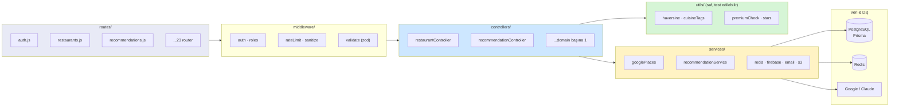

**Anahtar desen — "saf çekirdek + kabuk":** Karmaşık karar mantığı dış dünyaya dokunmayan saf
fonksiyonlara taşınır (`utils/restaurantAnalytics.js`, `services/personalizationService.js`,
`services/friendSuggestionService.js`). Böylece 1100+ test, gerçek Google/AI çağrısı yapmadan
"şu girdi → bu çıktı mı?" diye saniyeler içinde koşar (`tests/setup.js` Firebase/Resend/
Anthropic'i mock'lar).

---

## 5. Mobil uygulama mimarisi

Veri akışı **tek yönlüdür**: Ekran → Store → Service → API → backend, sonra ters yönde state
güncellenir ve ekran otomatik yeniden çizilir.

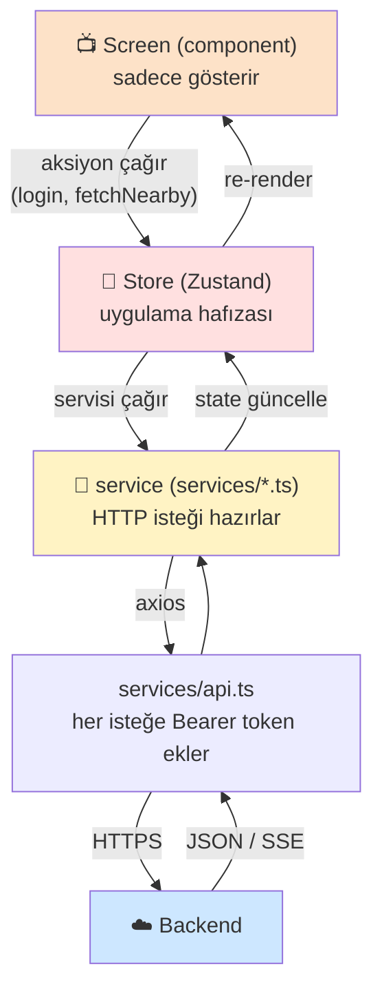

**Zustand store'ları (uygulamanın hafızası):**

| Store | Tutar |
|-------|-------|
| `authStore` | Oturum + rol (USER/RESTAURANT/ADMIN) |
| `restaurantStore` | Keşfet listesi + önbellek (stale-while-revalidate) |
| `aiRecommendationStore` | AI SSE akış durumu |
| `favoriteStore`, `collectionStore`, `friendStore` | Favori / liste / arkadaş |
| `messageStore`, `notificationStore` | Mesaj / bildirim |
| `themeStore` | Karanlık/aydınlık tema |

**Performans cilaları:**
- **Stale-while-revalidate (S15-P2):** Açılışta son listeyi diskten *anında* boyar, arka
  planda yenisini çekip sessizce değiştirir → skeleton bekleme yok (`utils/listCache.ts`).
- **Tipli API katmanı:** Servisler `src/types`'taki paylaşılan arayüzlere göre tiplenir
  (`tsc --noEmit` temiz).
- **Liste performansı:** `theme/listPerf.ts` ortak props + `React.memo`'lu kart satırları.

---

## 6. Üç rol ve ekran ağacı

Aynı uygulama, giriş yapan kişinin rolüne göre **tamamen farklı** bir ekran ağacı yükler
([navigation/index.tsx](neareat-mobile/src/navigation/index.tsx)).

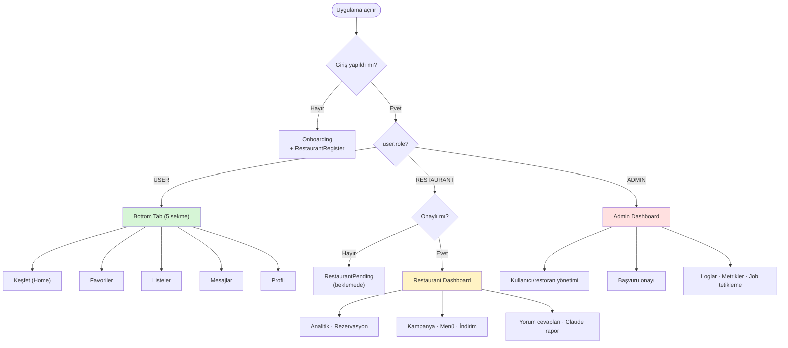

Backend tarafında `middleware/roles.js` aynı yetkiyi her istekte sunucuda da doğrular —
istemciye asla güvenilmez.

---

## 7. Veri modeli (ER diyagramı)

**Kritik tasarım kararı:** Restoranların kendisi DB'de saklanmaz! Restoran verisi Google
Places'ten anlık gelir; DB sadece **kullanıcı verisini** tutar ve restorana bir `placeId`
(Google kimliği) ile bağlar. `User` her şeyin merkezindedir.

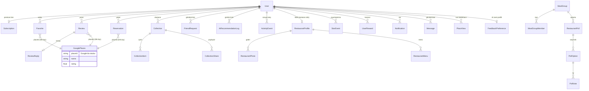

> Toplam ~40 tablo var. Yukarıda en önemli ilişkiler gösterildi. `Subscription` premium tier'i
> kontrol eder (ücretsiz limitler `utils/premiumCheck.js`'te uygulanır); `PurchaseEvent` IAP
> satın alma defteridir (token HMAC-hash'li); `UserLog` admin denetim izidir.

---

## 8. Önemli akışlar

### 8.1 Giriş (iki yol → aynı JWT)

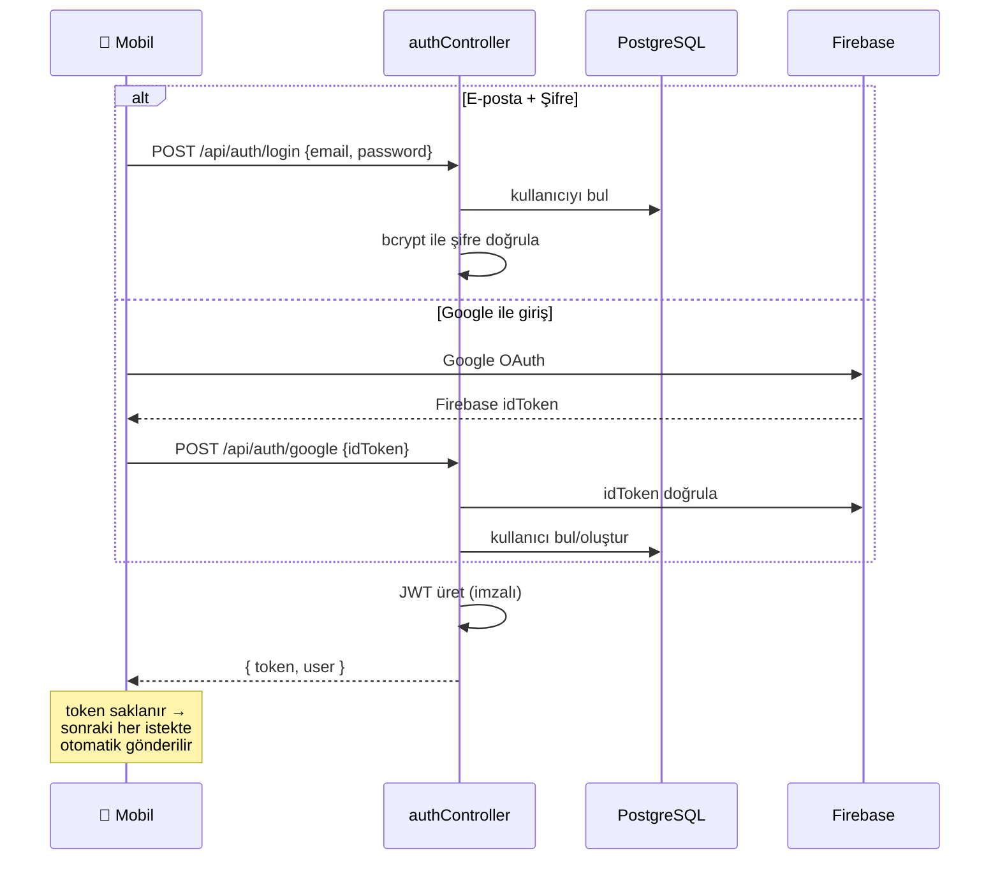

İki yol da **aynı JWT'yi** üretir; sonraki tüm uçlar fark gözetmez.

### 8.2 Yakındaki restoranlar (Redis maliyet kalkanı)

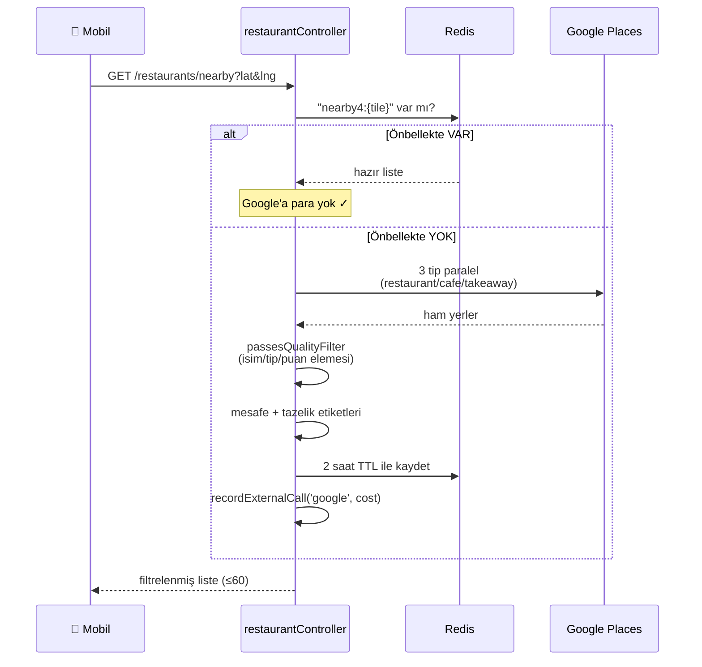

Redis burada **maliyet kalkanı**: aynı bölgeden gelen yüzlerce kişiye Google bir kez ödenir.

### 8.3 AI yemek önerisi (katmanlı maliyet koruması + streaming)

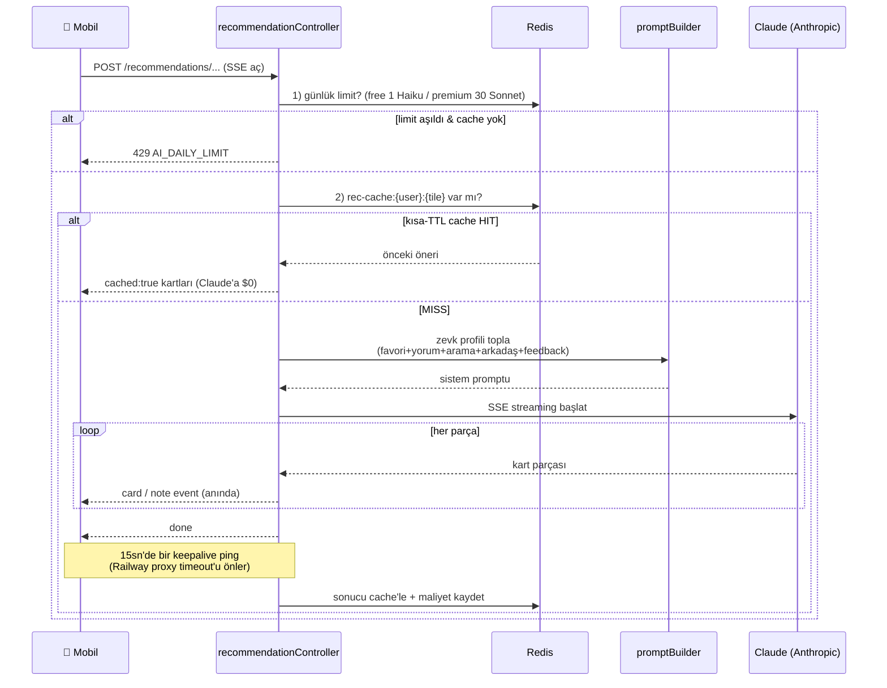

Sıralama bilinçli: **önce limit, sonra cache, en son AI.** AI en pahalı kaynak olduğundan en
sona bırakılır.

---

## 9. Zamanlanmış işler (cron)

`jobs/` altındaki görevler kimse tetiklemese de zamanında çalışır. Çoklu replikada **aynı turun
iki kez çalışmaması** için Redis tabanlı kilit (`withCronLock`) kullanılır.

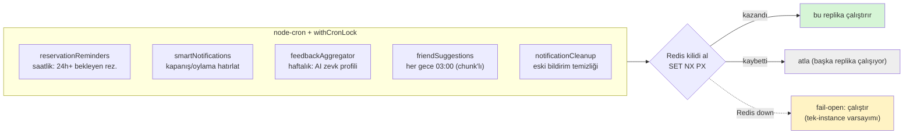

İkinci savunma hattı her işin **idempotency** kontrolüdür (ör. `pendingReminderSentAt` damgası
→ aynı hatırlatma iki kez gönderilmez). Admin manuel tetiklemeleri kilidi atlar, hep çalışır.

---

## 10. Dağıtım ve ölçeklenme

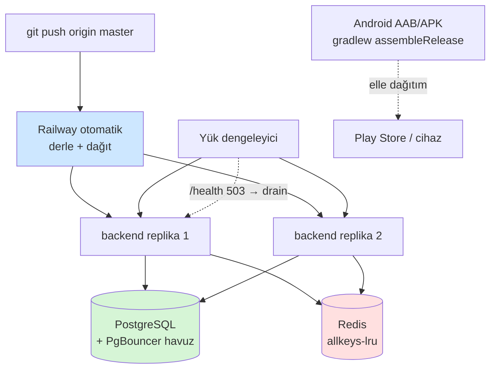

**10k kullanıcı hedefi için yapılanlar (Sprint-16):**
- **gzip sıkıştırma** (SSE muaf) · keep-alive timeout ayarı (502 önleme)
- **AI maliyet tavanı** (premium günlük cap) + kısa-TTL response cache
- **Google çağrı azaltma** (5 tip → 3 tip, %40 tasarruf) + 2 saat cache
- **friend-suggestions batch** (chunk'lı, tek Redis pipeline)
- **cron leader-lock** (replika-güvenli)
- **DB bağlantı havuzu** (`url`=pooler / `directUrl`=direct, PgBouncer)
- **yatay ölçeklenme** (graceful shutdown + `/health` drain → sıfır kesintili deploy)
- **metrik/alarm** (`GET /api/admin/metrics`: p50/p95/p99, hata oranı, dış API maliyeti)
- **k6 yük testleri** (sadece staging, production-guard'lı)

---

## Tek cümlede özet

> **Eatlas = "aptal ve hızlı" bir mobil arayüz (React Native + Zustand) + "akıllı ve korumalı"
> bir backend (Express + katmanlı boru hattı); backend kullanıcı verisini PostgreSQL'de tutar,
> restoranı Google'dan çeker ve Redis ile ucuzlatır, Claude ile kişiye özel öneri üretir
> (katman katman maliyet koruması), üç rolü (kullanıcı/restoran/admin) tek sistemde yönetir ve
> Railway'de replika-güvenli şekilde ölçeklenir.**
