# Eatlas (NearEat) Sisteminin SysML ile Modellenmesi

> Bu doküman, **Eatlas (NearEat)** restoran keşif platformunu **SysML (Systems Modeling
> Language)** ile adım adım modeller. Her adımda *ne* yaptığımızı, *neden* o diyagramı/yapıyı
> seçtiğimizi ve modelin sistemin hangi yönünü yakaladığını açıklar.
>
> Her diyagram **iki biçimde** verilir:
> 1. **SysML v2 metinsel gösterimi** — dilin resmî, araçtan bağımsız, makine-okunur hâli.
> 2. **Görsel diyagram (Mermaid/PlantUML)** — GitHub/VS Code'da otomatik çizilir.
>
> Karşılaştırma için kardeş dokümanlar: mimari için [MIMARI.md](MIMARI.md), anlamsal
> modelleme için [ONTOLOJI_MAKALESI.md](ONTOLOJI_MAKALESI.md).

---

## İçindekiler

1. [SysML nedir, neden kullanırız?](#1-sysml-nedir-neden-kullanırız)
2. [Modelleme yaklaşımı: dört sütun, dokuz diyagram](#2-modelleme-yaklaşımı-dört-sütun-dokuz-diyagram)
3. [Adım 0 — Paket diyagramı (modelin iskeleti)](#adım-0--paket-diyagramı-modelin-iskeleti)
4. [Adım 1 — Gereksinim diyagramı (Requirements)](#adım-1--gereksinim-diyagramı-requirements)
5. [Adım 2 — Kullanım senaryosu diyagramı (Use Case)](#adım-2--kullanım-senaryosu-diyagramı-use-case)
6. [Adım 3 — Blok Tanım Diyagramı (BDD) — yapı](#adım-3--blok-tanım-diyagramı-bdd--yapı)
7. [Adım 4 — İç Blok Diyagramı (IBD) — bağlantılar ve portlar](#adım-4--iç-blok-diyagramı-ibd--bağlantılar-ve-portlar)
8. [Adım 5 — Aktivite diyagramı (AI öneri akışı)](#adım-5--aktivite-diyagramı-ai-öneri-akışı)
9. [Adım 6 — Sıralama diyagramı (istek boru hattı)](#adım-6--sıralama-diyagramı-istek-boru-hattı)
10. [Adım 7 — Durum makinesi (Rezervasyon yaşam döngüsü)](#adım-7--durum-makinesi-rezervasyon-yaşam-döngüsü)
11. [Adım 8 — Parametrik diyagram (premium limitleri & AI maliyet kısıtı)](#adım-8--parametrik-diyagram-premium-limitleri--ai-maliyet-kısıtı)
12. [Adım 9 — İzlenebilirlik (gereksinim → blok → test)](#adım-9--izlenebilirlik-gereksinim--blok--test)
13. [Sonuç ve araçlar](#13-sonuç-ve-araçlar)

---

## 1. SysML nedir, neden kullanırız?

**SysML**, UML'in sistem mühendisliği için uyarlanmış bir profilidir (UML 2'nin bir alt
kümesi + sistem kavramları için eklentiler). Yalnızca yazılımı değil, **bir sistemin
tamamını** — gereksinimleri, yapısını, davranışını ve fiziksel/matematiksel kısıtlarını —
tek bir tutarlı modelde tarif eder.

| | DB Şeması / ER | OWL Ontolojisi | **SysML** |
|---|---|---|---|
| Cevapladığı soru | Veri *nasıl saklanır?* | Veri *ne anlama gelir?* | Sistem *neyi, nasıl, neden yapar?* |
| Kapsam | Tablolar | Kavramlar + çıkarım | Gereksinim + yapı + davranış + kısıt |
| Eatlas'taki rolü | `prisma/schema.prisma` | `neareat-ontology.ttl` | **bu doküman** |

**Neden Eatlas için SysML?** Eatlas tek bir "yazılım" değil; mobil istemci, backend, üç
dış servis ailesi (Google/Anthropic/Firebase…), zamanlanmış işler, iki abonelik katmanı ve
maliyet kısıtları olan bir **sistemdir**. SysML bu heterojen parçaları:
- aralarındaki **gereksinim → tasarım → test** izini koparmadan,
- davranışı (AI akışı, rezervasyon döngüsü) ile yapısını (bloklar, portlar) **aynı dilde**,
- ve "premium = 30 AI/gün" gibi sayısal kısıtları **parametrik** olarak

modelleyebilir. ER ve OWL bunların yalnızca bir dilimini yakalar.

---

## 2. Modelleme yaklaşımı: dört sütun, dokuz diyagram

SysML diyagramları **dört sütun** (pillar) altında toplanır. Modeli bu sırayla kurarız
çünkü her sütun bir öncekine dayanır:

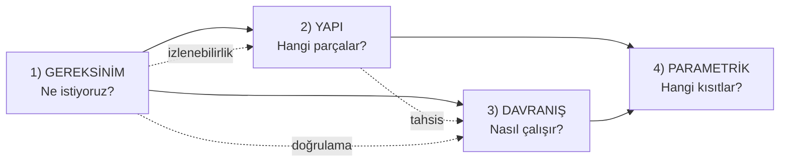

| Sütun | SysML diyagramı | Eatlas'ta ne yakalar | Bu dokümandaki adım |
|---|---|---|---|
| (organizasyon) | **Package** | Modelin klasör yapısı | Adım 0 |
| Gereksinim | **Requirement** | "1/gün AI", "premium sınırsız" | Adım 1 |
| Davranış | **Use Case** | Aktörler + sistem yetenekleri | Adım 2 |
| Yapı | **Block Definition (BDD)** | Mobil/Backend/DB/Servis blokları | Adım 3 |
| Yapı | **Internal Block (IBD)** | Bloklar arası port/akış | Adım 4 |
| Davranış | **Activity** | AI öneri iş akışı | Adım 5 |
| Davranış | **Sequence** | İstek boru hattı | Adım 6 |
| Davranış | **State Machine** | Rezervasyon durumları | Adım 7 |
| Parametrik | **Parametric** | Tarife limitleri, AI maliyet tavanı | Adım 8 |

> **Sıralama gerekçesi:** Önce *ne istediğimizi* (gereksinim) sabitleriz; sonra bunu
> kimin/hangi yetenekle kullandığını (use case) belirleriz; sonra sistemi *parçalara*
> (yapı) böleriz; en son bu parçaların *nasıl davrandığını* (davranış) ve hangi *sayısal
> kurallara* (parametrik) uyduğunu modelleriz. Bu, gerçek sistem mühendisliği akışıdır.

---

## Adım 0 — Paket diyagramı (modelin iskeleti)

**Ne yapıyoruz?** Modelin kendisini mantıksal paketlere bölüyoruz. Bir model de bir kod
tabanı gibi organize edilmeli; aksi halde yüzlerce eleman tek torbada kaybolur.

**Neden ilk bu?** Sonraki tüm elemanlar (gereksinim, blok, aktivite…) bir pakete ait olur.
Paketler ayrıca **namespace** sağlar: `Yapı::Backend` ile `Davranış::Backend` çakışmaz.

### SysML v2 metinsel gösterimi
```sysml
package 'Eatlas Sistem Modeli' {
    package Gereksinimler;      // Adım 1
    package Aktörler;           // Adım 2
    package Yapı {              // Adım 3-4
        package Bloklar;
        package Arayüzler;      // portlar, akış öğeleri
    }
    package Davranış {          // Adım 5-7
        package Aktiviteler;
        package Etkileşimler;   // sequence
        package DurumMakineleri;
    }
    package Kısıtlar;           // Adım 8 (parametrik)
    package İzlenebilirlik;     // Adım 9
}
```

### Görsel
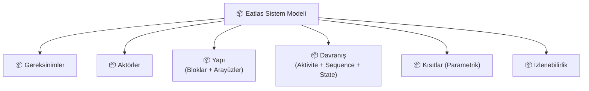

---

## Adım 1 — Gereksinim diyagramı (Requirements)

**Ne yapıyoruz?** Sistemin uyması gereken kuralları, sınanabilir gereksinimler hâline
getiriyoruz. SysML'in UML'den en büyük farkı budur: **gereksinim, modelin birinci sınıf bir
öğesidir** ve diğer her şeye (blok, test) bağlanabilir.

**Neden burada başlıyoruz?** Tasarım kararları gereksinimi *karşılamak* için vardır. Önce
gereksinimi yazarsak, sonraki her blok/aktivite "hangi gereksinimi karşılıyor?" sorusuna
cevap verebilir hâle gelir (Adım 9'daki izlenebilirlik). Gereksinimleri Eatlas'ın gerçek
kurallarından (tarife limitleri, KVKK, ölçeklenme) türetiyoruz.

### SysML v2 metinsel gösterimi
```sysml
requirement def 'Tarife Sınırlandırması' {
    doc /* Ücretsiz ve premium kullanıcılar farklı kotalara tabidir. */

    requirement <'R1'> ucretsizAiKotasi {
        doc /* Ücretsiz kullanıcı günde en fazla 1 AI önerisi alır. */
    }
    requirement <'R2'> premiumAiTavani {
        doc /* Premium kullanıcı Sonnet kullanır; günlük en fazla 30 çağrı (maliyet freni). */
    }
    requirement <'R3'> ucretsizFavoriLimiti {
        doc /* Ücretsiz kullanıcı en fazla 5 favori ekleyebilir. */
    }
}

requirement def 'Performans ve Ölçeklenme' {
    requirement <'R4'> yakinListeGecikme {
        doc /* /restaurants/nearby soğuk yüklemesi < 1 sn olmalı. */
    }
    requirement <'R5'> onBinKullanici {
        doc /* Sistem 10.000 eşzamanlı kullanıcıyı SPOF olmadan taşımalı. */
    }
}

requirement def 'Güvenlik ve Gizlilik' {
    requirement <'R6'> jwtKorumasi {
        doc /* Korumalı uçlar geçerli JWT ister. */
    }
    requirement <'R7'> kvkkVeriSilme {
        doc /* Kullanıcı arama geçmişini tümüyle veya tekil silebilmeli. */
    }
}
```

### Görsel (Mermaid `requirementDiagram`)
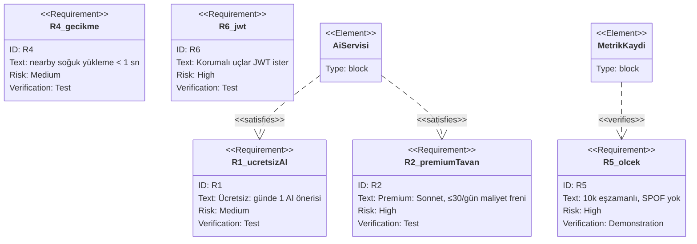

> **İlişki türleri (SysML'e özgü):** `satisfy` (bir blok gereksinimi karşılar),
> `verify` (bir test/öğe gereksinimi doğrular), `derive` (bir gereksinim diğerinden
> türer), `refine`, `trace`. Bunlar Adım 9'da matrise dönüşür.

---

## Adım 2 — Kullanım senaryosu diyagramı (Use Case)

**Ne yapıyoruz?** Sistemin dışındaki **aktörleri** (insan + dış sistem) ve onların sistemden
beklediği **yetenekleri** çiziyoruz. Bu, gereksinimleri "kim, ne için kullanır?" bağlamına
oturtur.

**Neden bu sırada?** Use case'ler gereksinim ile yapı arasında köprüdür: her yetenek bir
veya daha çok gereksinime dayanır ve sonra bir veya daha çok bloğa **tahsis** edilir.

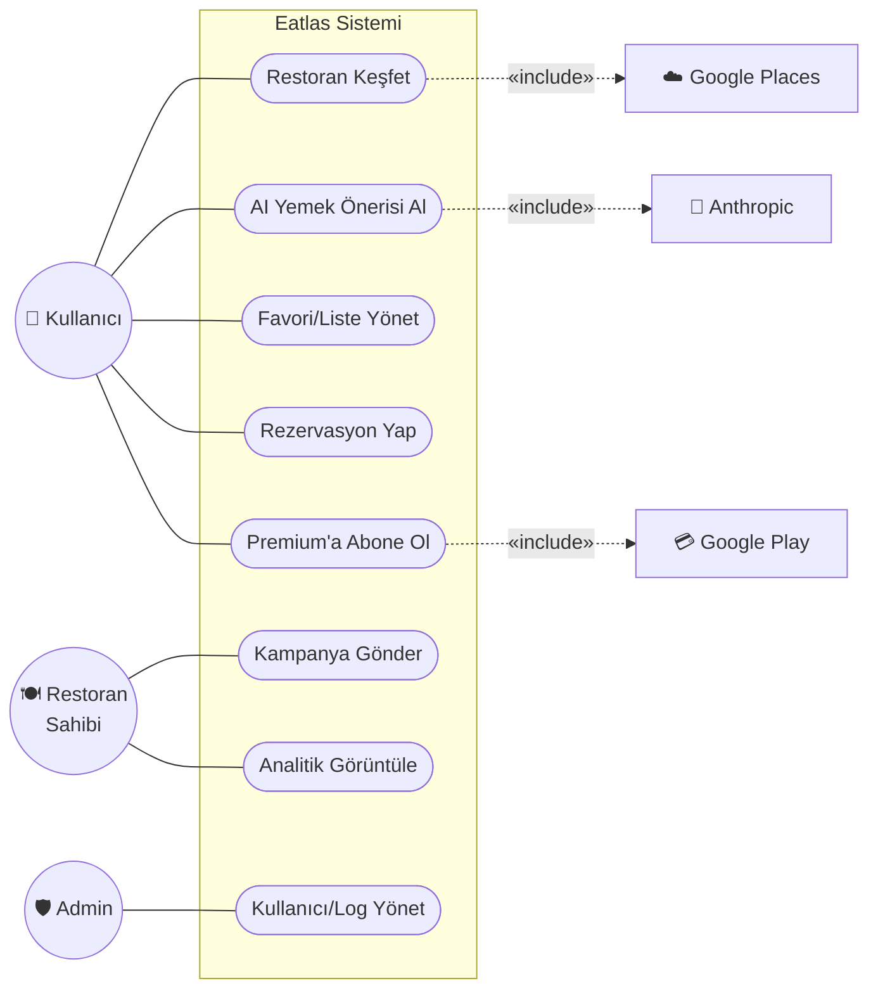

> **Not (`«include»`):** "Restoran Keşfet" her zaman Google Places çağrısını *içerir*;
> "AI Önerisi" Anthropic'i *içerir*. Bu bağımlılıklar Adım 4'teki port/akışlara dönüşecek.

---

## Adım 3 — Blok Tanım Diyagramı (BDD) — yapı

**Ne yapıyoruz?** Sistemi **bloklara** ayırıyoruz. Blok, SysML'in temel yapı taşıdır: bir
sistem parçasının türünü tanımlar (donanım, yazılım bileşeni, dış servis hepsi blok olabilir).
BDD bloklar arası **kompozisyon** (parça-bütün) ve **referans** ilişkilerini gösterir.

**Neden?** Davranışı modellemeden önce davranışın *üzerinde koşacağı* yapıyı sabitlemeliyiz.
Eatlas'ın doğal blokları MIMARI.md'deki bileşenlerle birebir örtüşür.

### SysML v2 metinsel gösterimi
```sysml
package Yapı::Bloklar {

    part def EatlasSistemi {
        part mobil       : MobilUygulama;
        part backend     : Backend;
        part veritabani  : PostgreSQL;
        part onbellek    : Redis;
        ref part disServisler : DisServis[0..*];
    }

    part def MobilUygulama {
        doc /* React Native + Expo + Zustand */
        part authStore        : Store;
        part restaurantStore  : Store;
        part aiStore          : Store;
        port apiBaglantisi    : HttpPort;   // backend'e
    }

    part def Backend {
        doc /* Node.js + Express + Prisma */
        part apiKatmani       : Router;     // routes/
        part middleware       : Middleware; // auth, rate-limit, sanitize...
        part controller       : Controller;
        part servisKatmani    : Servis;     // recommendation, googlePlaces...
        part cronIsleri       : CronJob[0..*];
        port istemciPort      : HttpPort;
        port veriPort         : DbPort;
    }

    // Dış servisler ortak bir soyutlamadan türer
    part def DisServis;
    part def GooglePlaces      :> DisServis;
    part def AnthropicClaude   :> DisServis;
    part def Firebase          :> DisServis;
    part def Resend            :> DisServis;
    part def GooglePlayIAP     :> DisServis;
    part def AwsS3             :> DisServis;
    part def Sentry            :> DisServis;
}
```

### Görsel (Mermaid `classDiagram`, bloklar `«block»` damgalı)
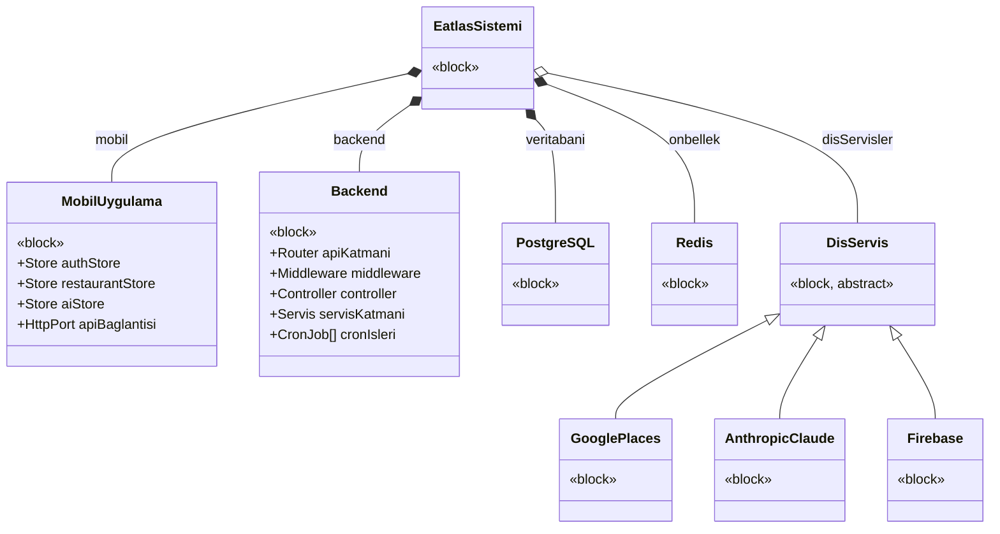

> **`*--` (kompozisyon) vs `o--` (agregasyon):** Mobil ve Backend sistemin *parçasıdır*
> (siyah elmas, yaşam döngüsü sisteme bağlı). Dış servisler *referanslanır* (içi boş elmas,
> bağımsız yaşar — Google bizden bağımsızdır). Bu ayrım SysML'de anlamlıdır.

---

## Adım 4 — İç Blok Diyagramı (IBD) — bağlantılar ve portlar

**Ne yapıyoruz?** BDD blokların *türlerini* gösterdi; IBD ise bir bloğun *içindeki*
parçaların **portlar** üzerinden nasıl **bağlandığını** ve aralarında hangi **akış
öğelerinin** (item flow) gidip geldiğini gösterir.

**Neden ayrı bir diyagram?** BDD "nelerden oluşur" sorusunu, IBD "nasıl bağlıdır ve ne
akar" sorusunu yanıtlar. Eatlas'ta kritik olan akışlar: JSON istek/yanıt, SSE akışı, cache
get/set, harici API çağrıları.

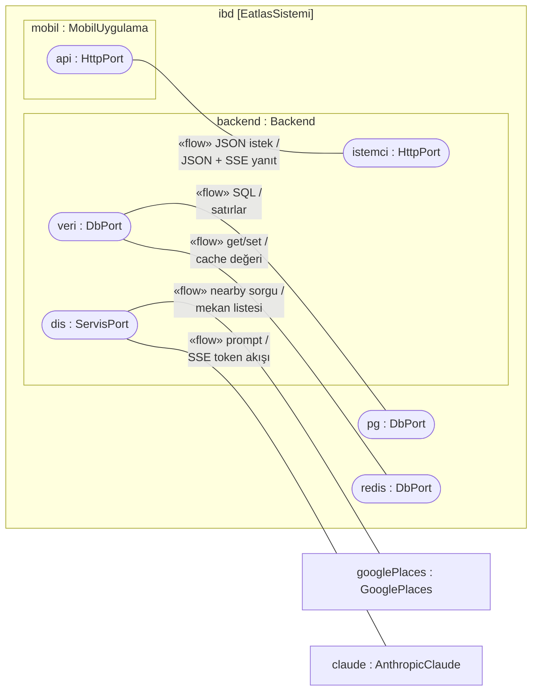

> **Port + akış neden önemli?** "Backend, Anthropic'e bir *prompt* gönderir ve geri *SSE
> token akışı* alır" cümlesi, modelde tipli bir `ItemFlow` olarak durur. Bu, R2 (maliyet
> tavanı) gibi gereksinimleri *tam olarak hangi portta* uyguladığımızı netleştirir.

---

## Adım 5 — Aktivite diyagramı (AI öneri akışı)

**Ne yapıyoruz?** Bir yeteneğin (UC2: AI Yemek Önerisi) **akışını** adım adım, karar ve
paralel kollarıyla modelliyoruz. Aktivite diyagramı "iş nasıl ilerler, kim ne yapar" için
kullanılır; **swimlane** (sorumluluk şeridi) ile her adımı bir bloğa **tahsis** ederiz.

**Neden bu akışı seçtik?** AI önerisi sistemin en karmaşık ve maliyet-duyarlı yoludur:
cache, tarife kapısı, streaming ve fallback içerir — yani gereksinim R1/R2'nin uygulandığı
yerdir.

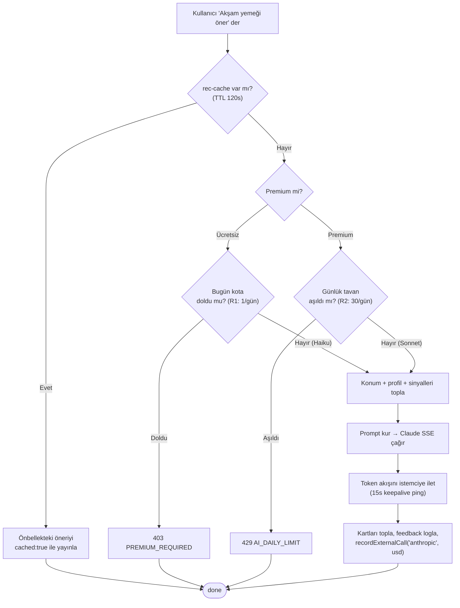

> **Tahsis (allocation):** Bu akıştaki "tarife kapısı" düğümleri `Backend.middleware` +
> `recommendationController`'a, "SSE çağrı" `servisKatmani`'na, "kota" kararı `PostgreSQL`'e
> tahsis edilir. SysML'de buna *activity → block allocation* denir ve R1/R2 ile aktiviteyi
> bağlar.

---

## Adım 6 — Sıralama diyagramı (istek boru hattı)

**Ne yapıyoruz?** Bloklar (artık "yaşam çizgileri") arasındaki **mesaj alışverişini zaman
sırasına** göre çiziyoruz. Aktivite "akışı", sequence "kim kime, hangi sırayla mesaj
gönderir"i gösterir — middleware zincirini en iyi bu yakalar.

**Neden?** MIMARI.md'deki boru hattını (`requestId → helmet → … → controller → servis`)
SysML etkileşimi olarak ifade ederek, R6 (JWT koruması) gibi gereksinimin tam olarak hangi
mesajda devreye girdiğini gösteririz.

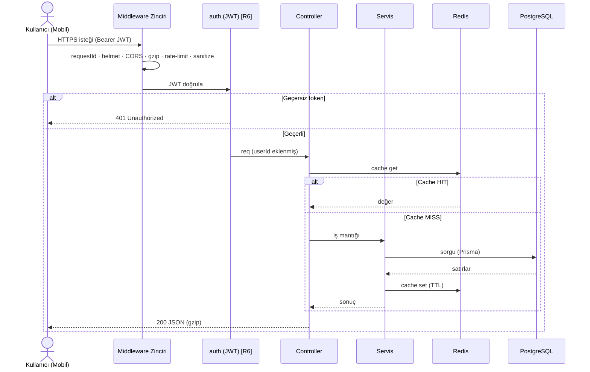

---

## Adım 7 — Durum makinesi (Rezervasyon yaşam döngüsü)

**Ne yapıyoruz?** Tek bir nesnenin (`Reservation`) zaman içindeki **durumlarını** ve
**geçişlerini** (tetikleyici/koşul/eylem) modelliyoruz. Durum makinesi, "bir varlık hangi
hâllerde olabilir ve neyle hâl değiştirir" sorusu için doğru araçtır.

**Neden rezervasyon?** Net bir yaşam döngüsü + zamana bağlı bir kural (`PENDING` 24 saati
aşarsa hatırlatma cron'u) içerir — durum makinesinin *time event* özelliğini gösterir.

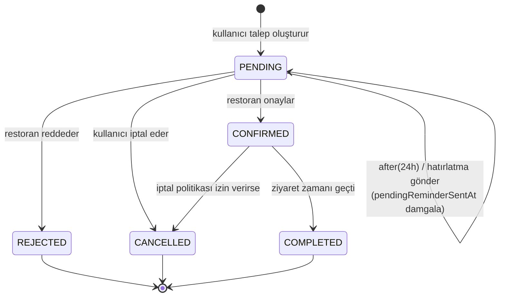

> **`after(24h)` (time event):** Bu öz-geçiş (`PENDING → PENDING`) doğrudan
> `jobs/reservationReminders.js` cron'una karşılık gelir. `pendingReminderSentAt`
> damgalaması, geçişin **idempotent** olmasını sağlar (aynı hatırlatma iki kez gitmez).

---

## Adım 8 — Parametrik diyagram (premium limitleri & AI maliyet kısıtı)

**Ne yapıyoruz?** Sistemin **sayısal kısıtlarını** denklem olarak modelliyoruz. Parametrik
diyagram, SysML'i UML'den ayıran ikinci büyük özelliktir: bloğun değer özelliklerini
(`value property`) **kısıt blokları** (`constraint block`) ile bağlar.

**Neden?** "Premium günde 30 çağrı" veya "Google maliyeti ~%40 düştü" gibi kurallar metinde
kaybolur; parametrik diyagramda bunlar **çözülebilir/denetlenebilir** denklemler olur ve
doğrudan R2/R5 gereksinimlerine bağlanır.

### SysML v2 metinsel gösterimi
```sysml
package Kısıtlar {

    // AI günlük maliyet/kota kısıtı (R1, R2)
    constraint def AiKotaKisiti {
        in premiumMi   : Boolean;
        in gunlukCagri : Natural;
        in tavan       : Natural;     // PREMIUM_AI_DAILY_CAP = 30
        in ucretsizKota: Natural = 1;
        // izinli ⇔ (premium ve çağrı<tavan) ya da (ücretsiz ve çağrı<1)
        izinli == (premiumMi ? (gunlukCagri < tavan) : (gunlukCagri < ucretsizKota));
    }

    // Günlük harcama alarmı (R5 ölçeklenme / maliyet freni)
    constraint def HarcamaAlarmi {
        in aiUsd       : Real;
        in googleUsd   : Real;
        in aiEsik      : Real = 50.0;   // ALARM_AI_DAILY_USD
        in googleEsik  : Real = 30.0;   // ALARM_GOOGLE_DAILY_USD
        alarm == (aiUsd > aiEsik) or (googleUsd > googleEsik);
    }

    // Ücretsiz tarife yapısal limitleri (R3)
    constraint def UcretsizLimitler {
        in favori, liste, rezervasyon : Natural;
        favori <= 5 and liste <= 1 and rezervasyon <= 1;
    }
}
```

### Görsel
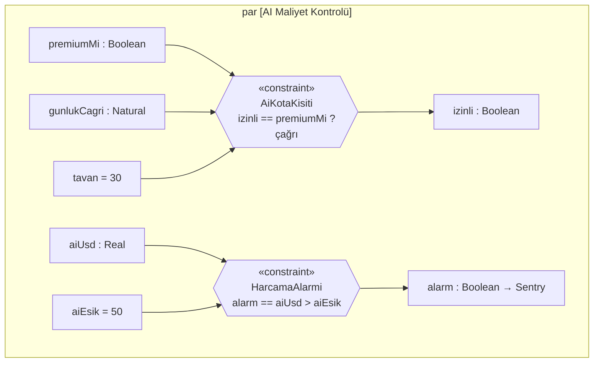

> **Bağlantı:** `gunlukCagri` değeri `Backend`'in metrik kaydından, `tavan` bir env
> değişkeninden (PREMIUM_AI_DAILY_CAP) bağlanır. `izinli == false` → Adım 5'teki "429
> AI_DAILY_LIMIT" dalı tetiklenir. Böylece **parametrik (kısıt) → aktivite (davranış) →
> gereksinim (R2)** zinciri kapanır.

---

## Adım 9 — İzlenebilirlik (gereksinim → blok → test)

**Ne yapıyoruz?** Modeli kapatan adım: her gereksinimi onu *karşılayan* bloğa ve onu
*doğrulayan* teste bağlayan **izlenebilirlik matrisi**. SysML'in vaadi budur — hiçbir
gereksinim sahipsiz, hiçbir tasarım gerekçesiz kalmaz.

**Neden son?** Önceki sekiz adımdaki tüm öğeler (gereksinim, blok, aktivite, kısıt) artık
var; bu adım onları `satisfy` / `verify` ilişkileriyle birbirine düğümler.

| Gereksinim | Karşılayan blok / öğe (`satisfy`) | Doğrulayan test (`verify`) |
|---|---|---|
| **R1** Ücretsiz 1 AI/gün | `recommendationController` + `premiumCheck` | `tests/.../ai-rate` |
| **R2** Premium ≤30/gün + cache | `AiKotaKisiti` + `recommendationService` | k6 `ai` senaryosu + jest |
| **R3** Favori ≤5 | `UcretsizLimitler` + ilgili controller | favori limit testi |
| **R4** nearby < 1 sn | `googlePlaces.getNearbyRestaurants` (tek-sayfa) | canlı ölçüm (0.76 sn) |
| **R5** 10k / SPOF yok | yatay replika + `cronLock` + metrik | k6 yük testi + `/admin/metrics` |
| **R6** JWT koruması | `middleware/auth.js` | auth integration testleri |
| **R7** KVKK silme | `search-history` DELETE uçları | search-history testleri |

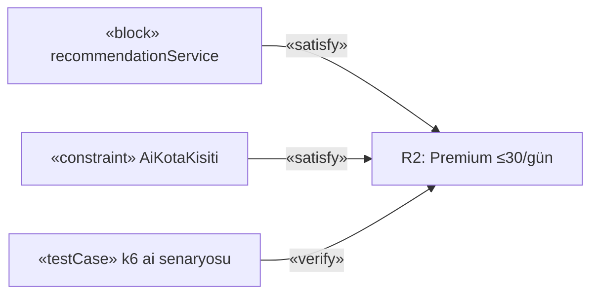

---

## 13. Sonuç ve araçlar

Bu modelle Eatlas'ı **dört sütunda** uçtan uca tarif ettik:

- **Gereksinim** (R1–R7) — sistemin sınanabilir kuralları, birinci sınıf model öğesi olarak.
- **Yapı** (BDD + IBD) — blok kompozisyonu, dış servis referansları, port + akış öğeleri.
- **Davranış** (Activity + Sequence + State) — AI akışı, istek boru hattı, rezervasyon döngüsü.
- **Parametrik** — tarife/maliyet kısıtları çözülebilir denklem olarak.
- **İzlenebilirlik** — her gereksinim bir bloğa ve bir teste bağlı.

**ER/OWL ile farkı:** [schema.prisma](neareat-backend/prisma/schema.prisma) verinin *nasıl
saklandığını*, [neareat-ontology.ttl](neareat-ontology.ttl) verinin *ne anlama geldiğini*
söyler. Bu SysML modeli ise sistemin *ne yapması gerektiğini, hangi parçalardan oluştuğunu,
nasıl davrandığını ve hangi kısıtlara uyduğunu* — yani **sistem mühendisliği** boyutunu —
yakalar. Üçü birbirini tamamlar.

### Araçlar
| Amaç | Araç |
|---|---|
| SysML v2 metinsel (yukarıdaki bloklar) | **SysIDE** (VS Code eklentisi), Pilot Implementation |
| SysML v1.6 tam diyagram editörü | **Eclipse Papyrus**, **Cameo Systems Modeler**, **Modelio** |
| Görselleri bu repoda render etmek | **Mermaid** (GitHub/VS Code yerleşik), **PlantUML** |
| Gereksinim izlenebilirliği | yukarıdaki matris + araç içi *traceability matrix* |

> Bu doküman içindeki SysML v2 blokları gerçek dil sözdizimidir; bir SysML v2 aracına
> kopyalanıp ayrıştırılabilir. Mermaid görselleri ise gözle inceleme içindir.
